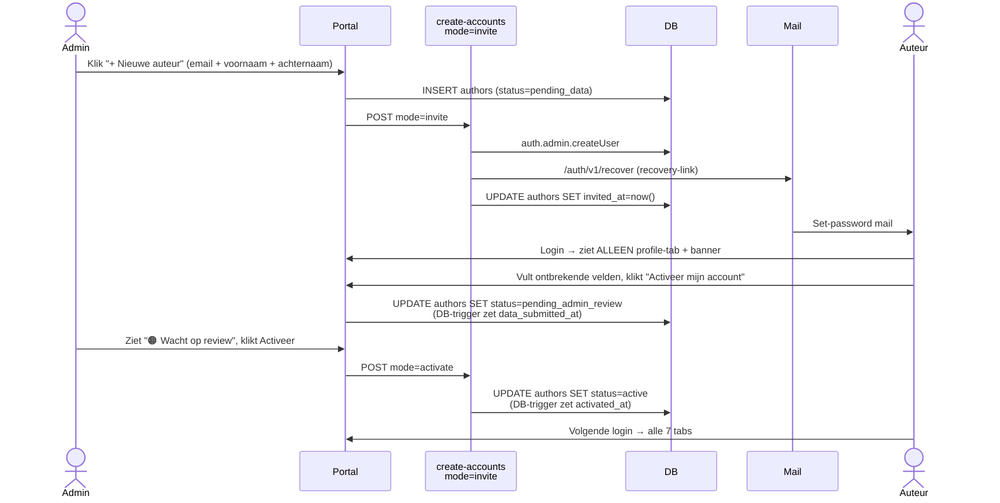
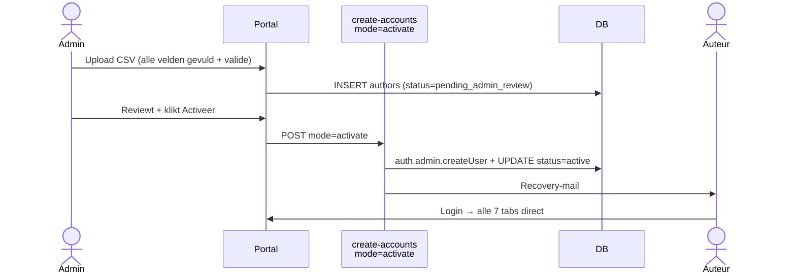

# Noordhoff Auteursportaal

Productie-versie van het Noordhoff Auteursportaal. Auteurs kunnen hun royalty-afrekeningen, contracten, prognoses en jaaropgaven inzien. Een Noordhoff-administrator beheert auteur-accounts, uploadt statements en activeert nieuwe auteurs voor toegang.

## 1. Wat is dit

Een TypeScript single-page applicatie die op GitHub Pages draait, met Supabase als backend voor authenticatie, database en file-storage. Het portaal vervangt de eerdere demo-versie (`SingaporeCity/Royaltyportaal`) en is opgezet voor security-review door Infinitas IT.

**Stakeholders:**

- **Charlotte Phillips** (eerste echte auteur)
- **Noordhoff-administrator** (`admin@noordhoff.nl`) — beheert accounts en uploadt statements
- **Infinitas IT** — review, SSO-configuratie, custom domain

## 2. Architectuur

```
┌────────────────┐      ┌──────────────────────┐      ┌─────────────────┐
│  Browser       │ HTTPS│  GitHub Pages        │      │ Supabase        │
│  (auteur of    │─────▶│  mijn-noordhoff.nl   │─────▶│ - Auth          │
│   admin)       │      │  (statisch SPA)      │      │ - Postgres+RLS  │
└────────────────┘      └──────────────────────┘      │ - Storage       │
                                                       │ - Edge Functions│
                                                       └─────────────────┘
```

| Laag           | Stack                                                                 |
| -------------- | --------------------------------------------------------------------- |
| Frontend       | TypeScript (strict), Vite, vanilla DOM, geen UI-framework             |
| Auth admin     | Microsoft Entra ID (OAuth, **placeholder** — pas actief na IT-config) |
| Auth auteur    | Supabase email + password met activate-email                          |
| Database       | Postgres met Row Level Security (RLS) op alle tabellen                |
| File storage   | Supabase Storage bucket `statements` (private, UUID-pad-isolatie)     |
| Edge Functions | Deno TypeScript (server-side, gebruikt service_role)                  |
| CI/CD          | GitHub Actions: lint + typecheck + tests + GH Pages deploy            |
| Custom domain  | `mijn-noordhoff.nl` (CNAME → GitHub Pages)                            |

### Documentatie voor IT-review

- **[docs/SECURITY.md](docs/SECURITY.md)** — bedreigingsmodel, RLS-policies per tabel, secret-management, XSS-prevention, CI-security-checks, bekende beperkingen
- **[docs/adr/0001-typescript-strict-vanilla.md](docs/adr/0001-typescript-strict-vanilla.md)** — waarom geen framework
- **[docs/adr/0002-rls-whitelist-via-is-active.md](docs/adr/0002-rls-whitelist-via-is-active.md)** — toegangscontrole-aanpak

## 3. Lokale setup

**Vereisten**: Node.js 20+, een lokale `.env` (zie `.env.example`).

```bash
# 1. Clone (na repo aanmaak)
git clone git@github.com:SingaporeCity/auteursportaal.git
cd auteursportaal

# 2. Installeer dependencies
npm install

# 3. Maak .env aan op basis van het template
cp .env.example .env
# Vul de Supabase URL + anon key in (vraag bij Patrick voor productie-keys)

# 4. Start de dev-server
npm run dev
# → http://localhost:5173
```

**Beschikbare scripts:**

| Script                  | Doel                                              |
| ----------------------- | ------------------------------------------------- |
| `npm run dev`           | Start Vite dev-server met HMR                     |
| `npm run build`         | Productie-build naar `dist/`                      |
| `npm run preview`       | Lokale preview van de build                       |
| `npm run typecheck`     | TypeScript strict-check (geen output bij succes)  |
| `npm run lint`          | ESLint (incl. security + secret-detection regels) |
| `npm run lint:fix`      | Auto-fixable lint-issues fixen                    |
| `npm run format`        | Prettier op alle bestanden                        |
| `npm run test`          | Vitest unit-tests                                 |
| `npm run test:coverage` | Tests met coverage-rapport                        |
| `npm run test:e2e`      | Playwright E2E-tests                              |

Pre-commit-hook (Husky + lint-staged) draait automatisch ESLint + Prettier op staged files.

## 4. Deploy

**Productie** wordt automatisch gedeployed bij elke push naar `main`:

1. GitHub Action `ci.yml` draait: `lint` → `typecheck` → `test` → `test:e2e`.
2. Bij groene CI: `deploy.yml` bouwt `dist/` met productie-env-vars en pusht naar de `gh-pages` branch.
3. GitHub Pages serveert `gh-pages` op `https://mijn-noordhoff.nl`.

**Repo secrets nodig in GitHub Actions:**

- `VITE_SUPABASE_URL`
- `VITE_SUPABASE_ANON_KEY`
- `VITE_ADMIN_EMAIL`

Service-role-key staat NIET in repo-secrets — alleen lokaal en (waar nodig) in Supabase Edge Function secrets.

**Edge Functions** worden separaat gedeployed via Supabase CLI (handmatig, na lokale review):

```bash
supabase functions deploy create-accounts --project-ref qcqjurglmrhdiuhawfee
```

## 5. Security

### Secret-management

| Secret                        | Waar                                 | In repo?      | In bundle?                                    |
| ----------------------------- | ------------------------------------ | ------------- | --------------------------------------------- |
| Supabase URL                  | env-var                              | ✅ via secret | ✅ public                                     |
| Supabase **anon** key         | env-var                              | ✅ via secret | ✅ public-safe (JWT role=anon, RLS-beschermd) |
| Supabase **service_role** key | Edge Function secret + lokale `.env` | ❌ NOOIT      | ❌ NOOIT                                      |
| Microsoft OAuth client secret | Supabase Dashboard                   | ❌ NOOIT      | ❌ NOOIT                                      |

ESLint-regels die secret-leaks blokkeren:

- `no-secrets/no-secrets` — detecteert JWT-shaped strings, AWS keys, etc.
- `no-unsanitized/property` — blokkeert `innerHTML` zonder DOMPurify.

### Row Level Security (RLS)

Alle tabellen in `public` schema hebben RLS enabled. Policies zijn `auth.uid()`-based per author of `is_admin = true` voor admin. Storage bucket `statements` isoleert per UUID-pad.

Volledig overzicht (na schema-migratie): zie `supabase/migrations/`.

### Content Security Policy

Strict CSP via meta-tag in `index.html`:

```
default-src 'self';
script-src 'self';
style-src 'self' 'unsafe-inline';
img-src 'self' data: https:;
connect-src 'self' https://*.supabase.co;
font-src 'self' data:;
object-src 'none';
base-uri 'self';
frame-ancestors 'none';
```

### Inputvalidatie

- Postcode (`isValidPostcodeNL`) en IBAN (`isValidIBAN` met mod-97-checksum) gevalideerd vóór save.
- BSN-validatie via 11-proef.
- Email-validatie.
- Alle wijzigingen door auteurs gaan via `change_requests`-tabel met admin-approval (geen directe writes naar `authors`).

## 6. Onboarding-flow

Vanaf iter 4 heeft elke auteur een `onboarding_status` (enum):

| Status                 | Betekenis                                        | Wie zet 'm?                                                                    |
| ---------------------- | ------------------------------------------------ | ------------------------------------------------------------------------------ |
| `pending_data`         | Auteur is uitgenodigd maar profiel is incompleet | Default bij INSERT (nieuwe auteur of CSV-row met gaten)                        |
| `pending_admin_review` | Auteur heeft data ingediend, wacht op admin-OK   | Auteur klikt "Activeer mijn account" (DB-trigger zet `data_submitted_at`)      |
| `active`               | Volledig portaal-toegang                         | Admin klikt "Activeer" (DB-trigger zet `activated_at` + sync `is_active=true`) |

Drie paden, één codebase:

### Pad A — handmatig nieuwe auteur (geen CSV beschikbaar)



### Pad B — incomplete CSV-import

Identiek aan pad A vanaf het moment dat auteur inlogt — verschil zit in de aanmaak: admin uploadt CSV, rij krijgt `pending_data` (gaten in data), admin klikt per-rij **Stuur uitnodiging**.

### Pad C — complete CSV-import (typisch bestaande auteurs uit NetSuite)



### Reminders

Niet-gereageerd na 14 dagen? Admin filtert "Wacht op auteur", knop **Stuur reminder** verschijnt en triggert dezelfde Edge Function (`mode=invite`), die `reminder_sent_at` zet. Geen scheduler/cron — bewust manueel voor IT-review-vriendelijkheid.

### CSV-format

Zie [docs/onboarding-csv-import.md](docs/onboarding-csv-import.md) voor kolomvolgorde, validatie en flow per status. Template in [docs/netsuite-author-import-template.csv](docs/netsuite-author-import-template.csv).

### Defense-in-depth via RLS

`payments`/`contracts`/`forecasts`/`expenses` zijn **alleen leesbaar voor `active`-auteurs** dankzij RLS-policies (`is_active_author()` helper). Een auteur in onboarding-status ziet 0 rijen in deze tabellen, ook bij directe DB-query met JWT. Frontend tab-gating is daar bovenop een UX-laag.

## 6b. Round-trip-sync naar NetSuite (CSV-export)

Het portaal is geen source-of-truth — NetSuite blijft dat. Nieuwe of gewijzigde auteursgegevens worden via een CSV terug-gesynchroniseerd:

```
Admin klikt "📤 Export naar NetSuite" in admin-portaal
  ↓
Edge Function `export-authors-csv`:
  - Admin-check via JWT
  - Selecteert rijen waar last_exported_at IS NULL OR last_exported_at < updated_at
  - Bouwt CSV in zelfde 15-koloms format als import
  - Schrijft audit-row in `data_exports`: admin_id, timestamp, row_ids, sha256, reason
  - Update last_exported_at op de geëxporteerde rijen
  - Streamt CSV terug (geen tussenopslag in Supabase Storage)
  ↓
Browser-download → admin uploadt direct naar Noordhoff SharePoint
  ↓
NetSuite-team verwerkt CSV (handmatig of via NetSuite-import-tool)
```

**Beveiligingsmaatregelen**:

- **Admin-only**: Edge Function checkt `is_admin()` via JWT vóór query
- **Audit-trail**: `data_exports` tabel met sha256-hash van CSV-content (anti-tamper)
- **Geen dubbele exports**: `last_exported_at` per rij voorkomt dat dezelfde wijziging twee keer in CSV terechtkomt
- **Geen tussenopslag**: CSV wordt gestreamd, niet permanent opgeslagen in Supabase
- **AVG-retention**: admin uploadt + verwijdert lokaal binnen minuten; SharePoint-retention is verantwoordelijkheid van Noordhoff IT
- **Dataminimalisatie open punt**: huidige export bevat alle 15 velden per rij. Voor strenger AVG-naleving op termijn: alleen daadwerkelijk-gewijzigde velden meesturen (vereist diff-tracking)

## 7. Testing

```bash
# Unit-tests (Vitest, jsdom)
npm run test
npm run test:coverage   # threshold: 80% lines

# E2E (Playwright, chromium + firefox)
npm run test:e2e
npm run test:e2e:ui     # interactieve modus
```

E2E-scenarios:

- Admin SSO-login (mocked Azure callback) → admin-dashboard zichtbaar
- Niet-whitelisted SSO-login → "geen toegang" + uitgelogd
- Onboarding end-to-end (admin maakt auteur → upload → activeer → email → wachtwoord → login → eigen data zichtbaar, andermans data NIET zichtbaar)
- Profile-change-request goedkeuring

Test-database: aparte Supabase test-project of ephemeral via `supabase db reset --local`.

## 8. Bekende beperkingen

> ⚠️ **BLOKKER VOOR PRODUCTIE-LAUNCH — externe SMTP-provider vereist**
>
> Het portaal verstuurt e-mails (invite-link, recovery, reminder) via Supabase's ingebouwde mailer. Die mailer is **niet productie-geschikt**:
>
> - **Rate limit**: 3 e-mails per uur per project. Bij bulk-onboarding van honderden auteurs is de limiet meteen vol → flow valt stil met `over_email_send_rate_limit`.
> - **Volume nodig in productie**: ~5000+ e-mails per maand realistisch (2500 auteurs × invite + reminder + ad-hoc password-resets + activatiebevestigingen).
> - **Deliverability**: Supabase-mailer stuurt vanaf `noreply@mail.app.supabase.io` — Outlook/Hotmail markeert dat vaak als spam.
> - **Branding**: huidige mails komen niet vanuit `noordhoff.nl`-domein — slecht voor herkenning + vertrouwen door auteurs.
>
> **Vóór productie-launch moet Noordhoff IT een transactionele SMTP-provider kiezen + configureren.** Drie geschikte opties:
>
> | Provider     | Free tier              | Kosten productie    | Notities                                          |
> | ------------ | ---------------------- | ------------------- | ------------------------------------------------- |
> | **Resend**   | 3.000/maand            | ~$20 voor 50k mails | Modern, eenvoudige API, goede deliverability      |
> | **SendGrid** | 100/dag (=3.000/maand) | ~$20 voor 50k mails | Veel features, complexer dashboard                |
> | **AWS SES**  | 200/dag in sandbox     | ~$0,10 per 1k mails | Goedkoopst maar vereist AWS-account + meer config |
>
> **Configuratie**: na keuze van provider → Supabase Dashboard → Project Settings → Authentication → SMTP Settings → vul host/port/credentials in. Gebruik een DNS-geverifieerd `noreply@mijn-noordhoff.nl` of `noreply@noordhoff.nl` adres met SPF/DKIM/DMARC records (anders blijft spam-issue).

| Item                          | Status                                   | Toelichting                                                                                                                                               |
| ----------------------------- | ---------------------------------------- | --------------------------------------------------------------------------------------------------------------------------------------------------------- |
| **Externe SMTP-provider**     | **BLOKKER — niet geconfigureerd**        | Zie waarschuwing hierboven. Productie-launch is afhankelijk van Resend/SendGrid/SES + DNS-records (SPF/DKIM/DMARC) op `noordhoff.nl`. Geen launch zonder. |
| Microsoft Entra ID SSO        | **Placeholder**                          | OAuth-call zit achter feature-flag `VITE_ADMIN_SSO_ENABLED=false`. Zet op `true` zodra Infinitas IT de Azure-tenant + admin consent heeft geconfigureerd. |
| Charlotte's BSN/geboortedatum | Placeholder (`000000000` / `1900-01-01`) | UI toont "ontbreekt" voor placeholderwaarden. Vervang met echte data zodra die intern bekend is.                                                          |
| Charlotte's Alliant ID        | Open                                     | Veld `NL00117322` uit NetSuite — onduidelijk of dit Alliant-ID of ander intern Noordhoff-nummer is. Geverifieerd worden door admin.                       |
| `sync-netsuite` Edge Function | Verwijderd                               | NetSuite-integratie buiten scope; CSV-import via admin-UI is voldoende voor pilot.                                                                        |
| Custom domain TLS             | Pending                                  | DNS-CNAME van `mijn-noordhoff.nl` schakelen pas na go-live van nieuwe repo. Verwacht ~5 min downtime.                                                     |

## Repo-structuur

```
.
├── src/
│   ├── auth/              # SSO placeholder, password-flow, session, whitelist
│   ├── dashboard/         # 7 tabs (start, payments, contracts, forecast, expenses, faq, profile)
│   ├── admin/             # Onboarding, upload, changes, content-management
│   ├── lib/               # supabase, format, validate, i18n, pdf
│   ├── i18n/              # nl, en, sv (type-veilig via TranslationKey union)
│   ├── types/             # db.ts (gegenereerd via supabase gen types)
│   ├── styles/            # CSS per domein
│   └── main.ts            # entry: route, init, dark-mode
├── tests/e2e/             # Playwright E2E specs
├── supabase/
│   ├── functions/         # Deno Edge Functions
│   └── migrations/        # SQL-migraties (in productie-project)
├── scripts/               # Lokale CLI (seed, bulk-upload) — gebruiken service_role
├── .github/workflows/     # CI + deploy
└── docs/adr/              # Architecture Decision Records
```

## Contact

Voor security-bevindingen of vragen: open een issue in deze repo of mail `rights@noordhoff.nl`.
